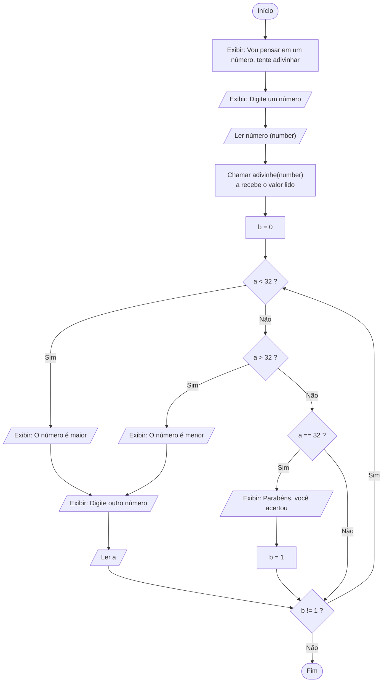

# Fluxograma - Adivinhe o número em Java

Fluxograma do programa `Alg07_2`, que pede um número até o usuário acertar o valor 32.

```mermaid
flowchart TD
    A([Início]) --> B["Exibir: Vou pensar em um número, tente adivinhar"]
    B --> C[/"Exibir: Digite um número"/]
    C --> D[/"Ler número (number)"/]
    D --> E["Chamar adivinhe(number)<br/>a recebe o valor lido"]
    E --> F["b = 0"]
    F --> G{"a < 32 ?"}

    G -- Sim --> H[/"Exibir: O número é maior"/]
    H --> I[/"Exibir: Digite outro número"/]
    I --> J[/"Ler a"/]
    J --> N

    G -- Não --> K{"a > 32 ?"}
    K -- Sim --> L[/"Exibir: O número é menor"/]
    L --> I

    K -- Não --> M{"a == 32 ?"}
    M -- Sim --> O[/"Exibir: Parabéns, você acertou"/]
    O --> P["b = 1"]
    P --> N
    M -- Não --> N

    N{"b != 1 ?"} -- Sim --> G
    N -- Não --> Q([Fim])

    
```
