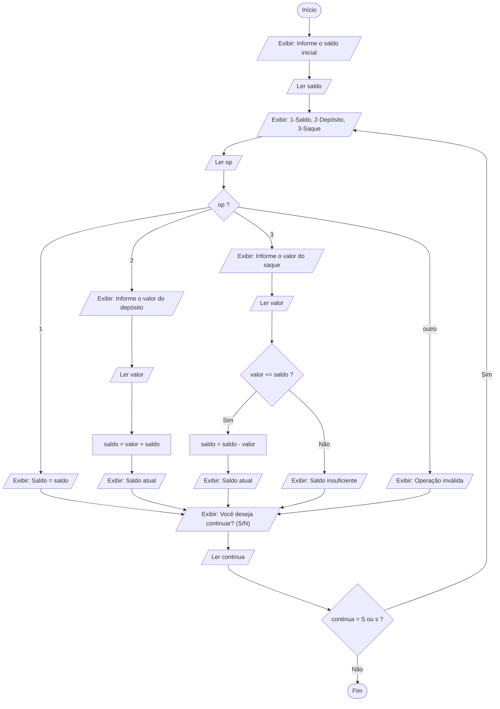

# Fluxograma - Caixa eletrônico em Java

Fluxograma do programa `Alg07_3`, que permite consultar saldo, depositar e sacar até o usuário decidir parar.

```mermaid
flowchart TD
    A([Início]) --> B[/"Exibir: Informe o saldo inicial"/]
    B --> C[/"Ler saldo"/]
    C --> D[/"Exibir: 1-Saldo, 2-Depósito, 3-Saque"/]
    D --> E[/"Ler op"/]
    E --> F{"op ?"}

    F -- "1" --> G[/"Exibir: Saldo = saldo"/]
    G --> Y

    F -- "2" --> H[/"Exibir: Informe o valor do depósito"/]
    H --> I[/"Ler valor"/]
    I --> J["saldo = valor + saldo"]
    J --> K[/"Exibir: Saldo atual"/]
    K --> Y

    F -- "3" --> L[/"Exibir: Informe o valor do saque"/]
    L --> M[/"Ler valor"/]
    M --> N{"valor <= saldo ?"}
    N -- Sim --> O["saldo = saldo - valor"]
    O --> P[/"Exibir: Saldo atual"/]
    P --> Y
    N -- Não --> Q[/"Exibir: Saldo insuficiente"/]
    Q --> Y

    F -- "outro" --> R[/"Exibir: Operação inválida"/]
    R --> Y

    Y[/"Exibir: Você deseja continuar? (S/N)"/] --> Z[/"Ler continua"/]
    Z --> W{"continua = S ou s ?"}
    W -- Sim --> D
    W -- Não --> X([Fim])

```
