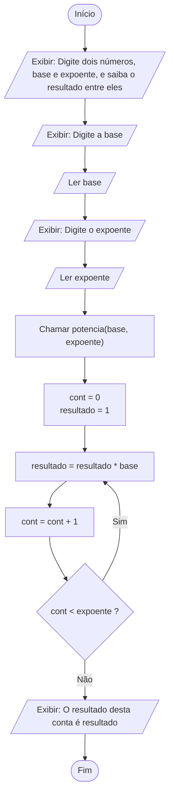

# Fluxograma - Potência em Java

Fluxograma do programa `Alg07_4`, que lê uma base e um expoente e calcula a potência por multiplicações sucessivas.

```mermaid
flowchart TD
    A([Início]) --> B[/"Exibir: Digite dois números, base e expoente, e saiba o resultado entre eles"/]
    B --> C[/"Exibir: Digite a base"/]
    C --> D[/"Ler base"/]
    D --> E[/"Exibir: Digite o expoente"/]
    E --> F[/"Ler expoente"/]
    F --> G["Chamar potencia(base, expoente)"]
    G --> H["cont = 0<br/>resultado = 1"]
    H --> I["resultado = resultado * base"]
    I --> J["cont = cont + 1"]
    J --> K{"cont < expoente ?"}
    K -- Sim --> I
    K -- Não --> L[/"Exibir: O resultado desta conta é resultado"/]
    L --> M([Fim])

```
