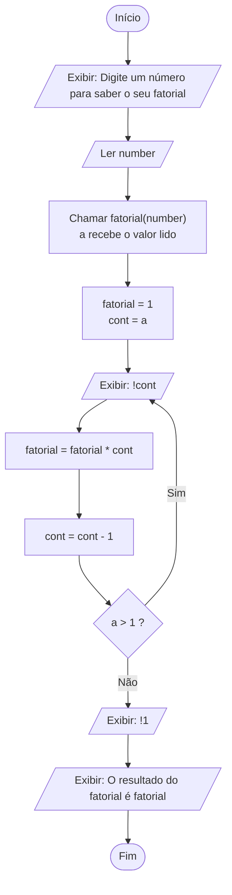

# Fluxograma - Fatorial em Java

Fluxograma do programa `Alg07_5`, que lê um número e tenta calcular seu fatorial.

```mermaid
flowchart TD
    A([Início]) --> B[/"Exibir: Digite um número para saber o seu fatorial"/]
    B --> C[/"Ler number"/]
    C --> D["Chamar fatorial(number)<br/>a recebe o valor lido"]
    D --> E["fatorial = 1<br/>cont = a"]
    E --> F[/"Exibir: !cont"/]
    F --> G["fatorial = fatorial * cont"]
    G --> H["cont = cont - 1"]
    H --> I{"a > 1 ?"}
    I -- Sim --> F
    I -- Não --> J[/"Exibir: !1"/]
    J --> K[/"Exibir: O resultado do fatorial é fatorial"/]
    K --> L([Fim])

```
