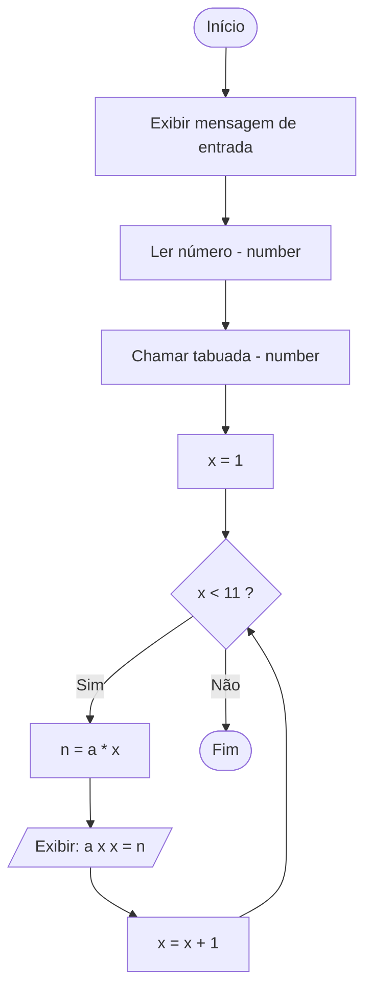

# Fluxograma - Tabuada em Java

Fluxograma do programa `Alg07_1`, que lê um número e exibe sua tabuada de 1 a 10.

```mermaid
flowchart TD
    A([Início]) --> B[Exibir mensagem de entrada]
    B --> C[Ler número - number]
    C --> D[Chamar tabuada - number]
    D --> E[x = 1]
    E --> F{x < 11 ?}
    F -- Sim --> G[n = a * x]
    G --> H[/Exibir: a x x = n/]
    H --> I[x = x + 1]
    I --> F
    F -- Não --> J([Fim])
```
